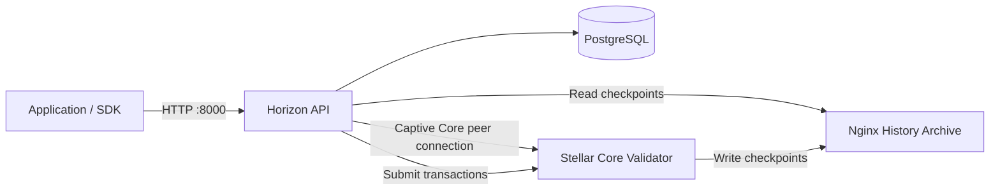

# Single-Node Private Stellar Network with Horizon

Run a standalone private Stellar network using Docker Compose.

The stack includes:

- one validating **Stellar Core** node
- **Horizon** with Captive Core ingestion
- **PostgreSQL** for Horizon
- an **Nginx history archive**
- persistent Docker volumes for Core, Horizon, PostgreSQL, and history data

> [!WARNING]
> This project is designed for local development, integration testing, demos, and isolated private environments.
>
> A single-validator network has no fault tolerance and is not suitable for a decentralized production deployment.

## Architecture



## Included versions

| Component | Image |
|---|---|
| Stellar Core | `stellar/stellar-core:27.1.0` |
| Stellar Horizon | `stellar/stellar-horizon:27.0.0` |
| PostgreSQL | `postgres:16-alpine` |
| Nginx | `nginx:1.27-alpine` |
| Target protocol | Protocol 27 |

The versions are pinned intentionally. Review Stellar's
[software version documentation](https://developers.stellar.org/docs/networks/software-versions)
before upgrading them.

## Prerequisites

Install:

- Docker Engine or Docker Desktop
- Docker Compose v2
- `curl`
- optionally `jq` for formatted JSON output

Confirm the installation:

```bash
docker --version
docker compose version
```

## Repository structure

```text
.
├── docker-compose.yml
├── .env.example
├── .gitignore
├── config
│   ├── stellar-core.cfg
│   └── stellar-captive-core.cfg
├── scripts
│   └── start-core.sh
└── secrets
    └── README.txt
```

## Quick start

### 1. Clone the repository

```bash
git clone <YOUR_REPOSITORY_URL>
cd <YOUR_REPOSITORY_DIRECTORY>
```

### 2. Generate the validator identity

Generate a new validator seed:

```bash
docker run --rm stellar/stellar-core:27.1.0 gen-seed
```

The command prints:

- a secret seed beginning with `S`
- its public key beginning with `G`

Create the validator secret file:

```bash
nano secrets/node_seed
```

Its entire content must follow this format:

```text
SXXXXXXXXXXXXXXXXXXXXXXXXXXXXXXXXXXXXXXXXXXXXXXXXXXXXXXX self
```

Replace the example value with the generated `S...` secret.

On Linux or macOS, restrict access to the file:

```bash
chmod 600 secrets/node_seed
```

> [!CAUTION]
> Never commit `secrets/node_seed`. It is ignored by the included `.gitignore`, but you should still verify it before every commit.

### 3. Configure Captive Core

Open:

```bash
nano config/stellar-captive-core.cfg
```

Replace:

```toml
PUBLIC_KEY="REPLACE_WITH_NODE_PUBLIC_KEY"
```

with the `G...` public key generated in the previous step:

```toml
PUBLIC_KEY="GXXXXXXXXXXXXXXXXXXXXXXXXXXXXXXXXXXXXXXXXXXXXXXXXXXXXXXX"
```

The validator public key in this file must correspond to the secret stored in `secrets/node_seed`.

### 4. Create the environment file

Copy the example:

```bash
cp .env.example .env
```

Edit it:

```bash
nano .env
```

Example:

```dotenv
POSTGRES_USER=stellar
POSTGRES_PASSWORD=ChangeThisToAStrongAlphanumericPassword
POSTGRES_DB=horizon

NETWORK_PASSPHRASE="Acme Private Stellar Network ; June 2026"
```

Use a unique passphrase for your network.

For the supplied configuration, the same passphrase must appear in all three locations:

- `.env`
- `config/stellar-core.cfg`
- `config/stellar-captive-core.cfg`

For example:

```toml
NETWORK_PASSPHRASE="Acme Private Stellar Network ; June 2026"
```

> [!IMPORTANT]
> The network passphrase is part of the network identity and transaction-signing domain.
> Changing it after initialization creates a different network identity.
>
> To change the passphrase safely, reset the stack with `docker compose down -v`, update all three locations, and initialize a new chain.

Use an alphanumeric PostgreSQL password unless you URL-encode special characters, because the password is embedded in Horizon's PostgreSQL connection URL.

### 5. Validate the Compose configuration

```bash
docker compose config
```

Pull the images:

```bash
docker compose pull
```

### 6. Start Stellar Core first

Start PostgreSQL, the history server, and Stellar Core:

```bash
docker compose up -d postgres history stellar-core
```

Follow Core logs:

```bash
docker compose logs -f stellar-core
```

The included `scripts/start-core.sh` initializes a new database and history archive only on the first run, then starts Core.

Check container state:

```bash
docker compose ps
```

Check the Core administrative endpoint:

```bash
curl -s http://127.0.0.1:11626/info
```

With `jq`:

```bash
curl -s http://127.0.0.1:11626/info | jq
```

Wait until Core is closing ledgers and the ledger number is increasing.

### 7. Upgrade the network to Protocol 27

A new standalone chain should be explicitly upgraded to the protocol and network settings you want.

Run:

```bash
curl -fsS \
  "http://127.0.0.1:11626/upgrades?mode=set&upgradetime=1970-01-01T00:00:00Z&protocolversion=27&basefee=100&basereserve=5000000"
```

The values above configure:

| Setting | Value |
|---|---:|
| Protocol version | `27` |
| Base fee | `100` stroops |
| Base reserve | `5,000,000` stroops = `0.5` native units |

Inspect Core again:

```bash
curl -s http://127.0.0.1:11626/info | jq
```

The upgrade is applied when the next eligible ledger closes.

### 8. Start Horizon

```bash
docker compose up -d horizon
```

Follow Horizon logs:

```bash
docker compose logs -f horizon
```

Verify the Horizon root endpoint:

```bash
curl -s http://127.0.0.1:8000/
```

With `jq`:

```bash
curl -s http://127.0.0.1:8000/ | jq
```

Horizon uses Captive Core to ingest ledgers. On a new standalone network, ingestion begins after Core produces the first usable history checkpoint.

### 9. Verify ingestion

Check the latest ledger:

```bash
curl -s \
  "http://127.0.0.1:8000/ledgers?order=desc&limit=1" | jq
```

Check important Horizon status fields:

```bash
curl -s http://127.0.0.1:8000/ | jq '{
  network_passphrase,
  core_latest_ledger,
  history_latest_ledger,
  current_protocol_version
}'
```

A healthy deployment should show:

- the configured custom network passphrase
- an increasing `core_latest_ledger`
- an increasing `history_latest_ledger`
- protocol version `27`

## Endpoints

| Service | URL | Exposure |
|---|---|---|
| Horizon | `http://127.0.0.1:8000` | Published by Compose |
| Stellar Core admin | `http://127.0.0.1:11626` | Host loopback only |
| Core peer port | `stellar-core:11625` | Docker network only |
| History archive | `http://history` | Docker network only |
| PostgreSQL | `postgres:5432` | Docker network only |

Example account query:

```bash
curl -s \
  "http://127.0.0.1:8000/accounts/GXXXXXXXXXXXXXXXXXXXXXXXXXXXXXXXXXXXXXXXXXXXXXXXXXXXXXXX" | jq
```

## Root account

A new standalone Stellar network has a root account containing the initial native-asset supply.

The root account is different from the validator identity:

| Identity | Purpose |
|---|---|
| Validator seed | Signs SCP messages for the Core validator |
| Root account seed | Signs transactions and funds new accounts |

The root account is deterministically derived from the network passphrase.

With Stellar CLI installed, derive its public key:

```bash
stellar network root-account public-key \
  --network-passphrase "Acme Private Stellar Network ; June 2026"
```

Derive its secret:

```bash
stellar network root-account secret \
  --network-passphrase "Acme Private Stellar Network ; June 2026"
```

You can also inspect the first Stellar Core startup logs:

```bash
docker compose logs stellar-core | grep -i -E "root|master|secret|account"
```

> [!CAUTION]
> The root account secret controls the initial native supply. Do not commit it, print it in CI logs, or expose it to client applications.

## Application configuration

Configure your SDK or backend with:

```text
Horizon URL:
http://127.0.0.1:8000

Network passphrase:
Acme Private Stellar Network ; June 2026
```

The passphrase used by the application must exactly match Core and Horizon. A transaction signed for a different passphrase will not be valid on this network.

### Example environment variables

```dotenv
STELLAR_HORIZON_URL=http://127.0.0.1:8000
STELLAR_NETWORK_PASSPHRASE=Acme Private Stellar Network ; June 2026
```

## Common operations

### Show service status

```bash
docker compose ps
```

### Follow all logs

```bash
docker compose logs -f
```

### Show recent Core logs

```bash
docker compose logs --tail=200 stellar-core
```

### Show recent Horizon logs

```bash
docker compose logs --tail=200 horizon
```

### Restart a service

```bash
docker compose restart stellar-core
docker compose restart horizon
```

### Stop while preserving data

```bash
docker compose down
```

### Start again

```bash
docker compose up -d
```

### Reset the entire private network

```bash
docker compose down -v
```

> [!WARNING]
> `docker compose down -v` permanently deletes:
>
> - the Stellar Core database
> - Core bucket data
> - the history archive
> - the Horizon database
> - Captive Core state
>
> After running it, you are creating a new blockchain.

## Persistent volumes

| Volume | Purpose |
|---|---|
| `core_data` | Stellar Core SQLite database and bucket files |
| `horizon_db` | Horizon PostgreSQL data |
| `horizon_captive` | Horizon Captive Core runtime data |
| `history_data` | Stellar history archive |

List the volumes:

```bash
docker volume ls | grep stellar-private
```

## Configuration notes

### One-node quorum

The Core configuration uses:

```toml
FAILURE_SAFETY=0
UNSAFE_QUORUM=true

[QUORUM_SET]
THRESHOLD_PERCENT=100
VALIDATORS=["$self"]
```

This lets a single validator externalize ledgers, but the network stops whenever that validator is unavailable.

### Accelerated development mode

The Core and Captive Core configurations use:

```toml
ARTIFICIALLY_ACCELERATE_TIME_FOR_TESTING=true
```

Horizon also uses:

```text
CHECKPOINT_FREQUENCY=8
```

These settings reduce waiting time in a development environment. Do not treat the resulting timing behavior as representative of a normal production Stellar network.

### History archive

Stellar Core writes history checkpoints to the shared `history_data` volume. Nginx exposes that volume to Horizon and Captive Core inside the Docker network.

## Troubleshooting

### Core container keeps restarting

Inspect the logs:

```bash
docker compose logs --tail=300 stellar-core
```

Common causes:

- invalid TOML syntax
- malformed `secrets/node_seed`
- missing `self` alias after the validator secret
- an unsupported Core configuration field
- volume permission problems

The seed file must contain exactly:

```text
SXXXXXXXXXXXXXXXXXXXXXXXXXXXXXXXXXXXXXXXXXXXXXXXXXXXXXXX self
```

### Core starts but does not close ledgers

Check:

```bash
curl -s http://127.0.0.1:11626/info | jq
docker compose logs --tail=300 stellar-core
```

Verify:

- `NODE_IS_VALIDATOR=true`
- `FAILURE_SAFETY=0`
- `UNSAFE_QUORUM=true`
- the quorum set contains `$self`
- the node seed file is readable inside the container

### Horizon starts but has no ledgers

Check all relevant logs:

```bash
docker compose logs --tail=300 horizon
docker compose logs --tail=300 stellar-core
```

Then verify Core:

```bash
curl -s http://127.0.0.1:11626/info | jq
```

Common causes:

- the network passphrase differs between files
- the Captive Core `PUBLIC_KEY` is incorrect
- Core has not produced the first history checkpoint yet
- Captive Core cannot reach `stellar-core:11625`
- the history archive is unavailable
- Horizon expected checkpoint frequency does not match the standalone setup

Test the history service from the Horizon container:

```bash
docker compose exec horizon sh -lc 'wget -qO- http://history/ || true'
```

Test the Core peer hostname:

```bash
docker compose exec horizon sh -lc 'getent hosts stellar-core || true'
```

### Horizon reports PostgreSQL connection errors

Check PostgreSQL:

```bash
docker compose logs --tail=200 postgres
docker compose exec postgres \
  pg_isready -U "${POSTGRES_USER:-stellar}" -d "${POSTGRES_DB:-horizon}"
```

If the password contains characters such as `@`, `:`, `/`, `?`, or `#`, URL-encode it or use a simpler alphanumeric password for this Compose configuration.

### Horizon database schema errors

The Horizon service is started with migration application enabled. Inspect:

```bash
docker compose logs --tail=300 horizon
```

For a disposable development environment, reset all volumes:

```bash
docker compose down -v
docker compose up -d postgres history stellar-core
```

After Core is healthy:

```bash
docker compose up -d horizon
```

### Configuration changed but the old chain remains

Configuration files are mounted immediately, but existing blockchain data remains in Docker volumes.

For changes that alter network identity or genesis behavior, perform a full reset:

```bash
docker compose down -v
docker compose up -d postgres history stellar-core
```

## Security

- Never expose the validator secret.
- Never expose the root account secret.
- Do not publish Core's administrative port to the internet.
- Put Horizon behind TLS and an authenticated reverse proxy when external access is required.
- Restrict firewall access to port `8000`.
- Back up persistent volumes before upgrades.
- Pin container versions instead of using `latest`.
- Review image release notes before upgrading.
- Do not use `PER_HOUR_RATE_LIMIT=0` on an untrusted public endpoint.

The supplied Compose file binds Core's administrative port to host loopback:

```yaml
ports:
  - "127.0.0.1:11626:11626"
```

Keep that restriction unless you have a protected administrative network.

## Production considerations

A serious private production deployment should use:

- at least three or four validators on separate machines
- a properly designed quorum set
- independent validator keys
- external, backed-up PostgreSQL
- redundant history archives
- TLS for every externally reachable API
- monitoring and alerting
- tested disaster-recovery procedures
- controlled protocol-upgrade procedures
- regular database and bucket backups

The supplied one-node setup deliberately prioritizes simplicity over availability and decentralization.

## Official documentation

- [Stellar Core validator documentation](https://developers.stellar.org/docs/validators)
- [Stellar Core configuration](https://developers.stellar.org/docs/validators/admin-guide/configuring)
- [Horizon administration](https://developers.stellar.org/docs/data/apis/horizon/admin-guide/overview)
- [Horizon configuration](https://developers.stellar.org/docs/data/apis/horizon/admin-guide/configuring)
- [Stellar network passphrases](https://developers.stellar.org/docs/networks)
- [Stellar software versions](https://developers.stellar.org/docs/networks/software-versions)
- [Stellar CLI root account commands](https://developers.stellar.org/docs/tools/cli/stellar-cli)

## License

Add the license appropriate for your repository before publishing it publicly.
